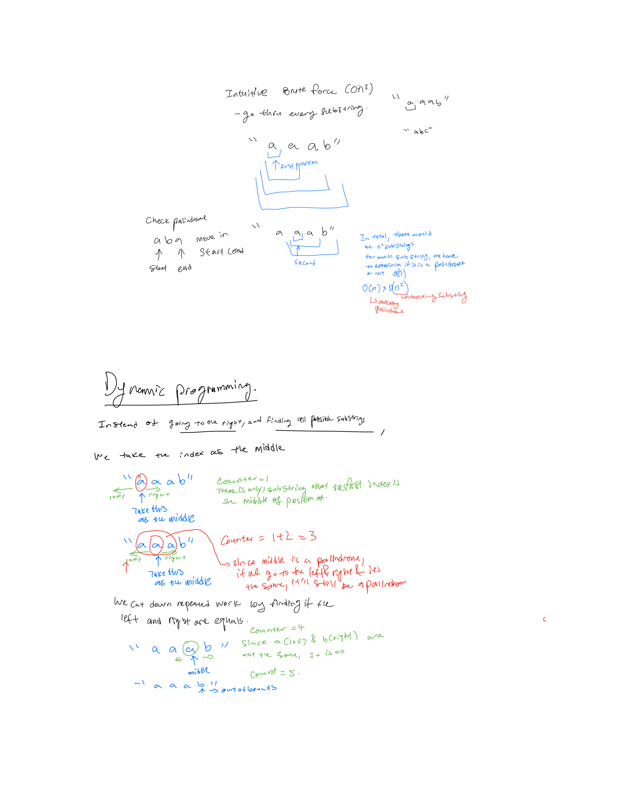

1. Brute force : approach in link

- Start from index 1 and find all the possible substrings index 1 to end can have

2. Dynamic programming

- treat each index as the middle and expand the left and right to reduce repeated work
- however with that you only get the odd case. for the even case, you need to start with the left and right index not being equal.

Approach in drawings:



### Recursive

```python
class Solution:
    def countSubstrings(self, s: str) -> int:
        length_substring = len(s)
        if length_substring < 2 : return length_substring

        self.res = 0
        for mid in range(length_substring):
            self.check_palindrome(s,mid,mid) # odd case -> left and right are equals -> mid
            self.check_palindrome(s,mid,mid +1) # even case -> take current and next index


        return self.res

    def check_palindrome(self,s,l,r):
        while l >= 0 and r < len(s):
            if s[l] == s[r]: # while left and right are inboud and left = right -> palindrome found
                self.res += 1
                # move the left and right
                l -= 1
                r += 1
            else:
                break
```

```golang
func countSubstrings(s string) int {
    if len(s) == 0{
        return 0
    }
    if len(s) == 1{
        return 1
    }
    counter := 0
    for i:=0;i<len(s);i++{
        // check for odd and even case
        counter += checkPalindrome(s,i,i)
        counter += checkPalindrome(s,i,i+1)

    }
    return counter
}


func checkPalindrome(s string , i int , j int) int{
    counter := 0
    left:= i
    right := j

    // check for end condition and if palindrome exist
    for left>=0 && right<len(s) && s[left] == s[right]{
        left --
        right ++
        counter ++
    }
    return counter

}
// time complexity ON^2
```
