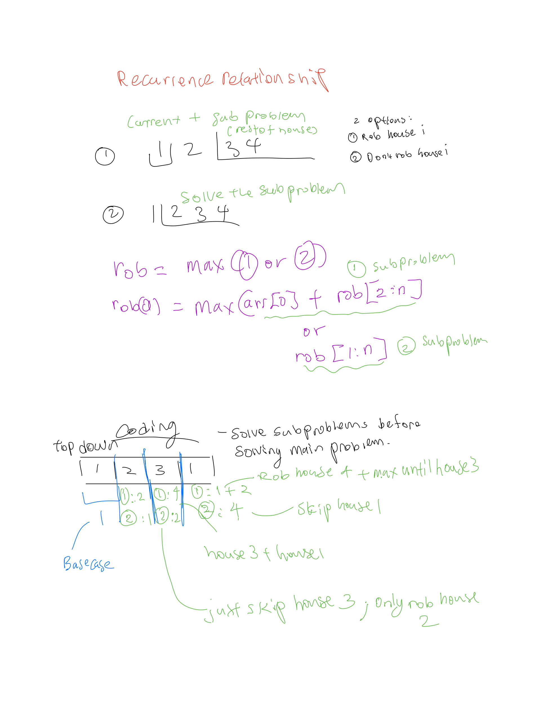
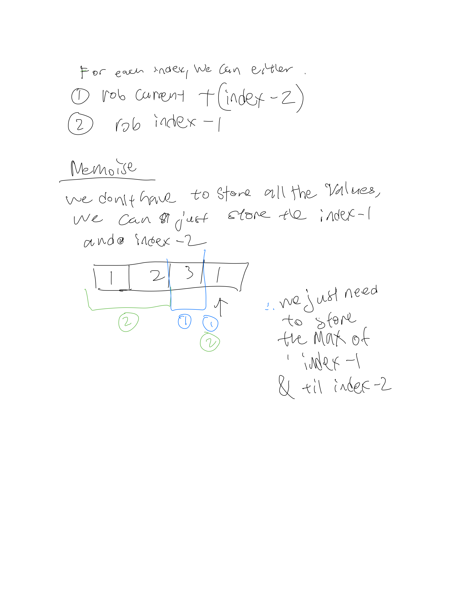

# Approach + Solution to house robber

This particular problem and most of others can be approached using the following sequence:

## Table of Content

1. [Find recursive relation](#find-recursive-relation)

1. [Recursive (top-down) approach](#recursive-top-down-approach)

1. [Recursive + memo (top-down) approach](#recursive-memo-top-down-approach)

1. [Iterative + memo (bottom-up)](#iterative-memo-bottom-up)

1. [Iterative + N variables (bottom-up)](#iterative-n-variables-bottom-up)

## 1. Find recursive relation



As the robber, you have 2 options:

1. Rob house i
   - it means she can't rob previous i-1 house but can safely proceed to the one before previous i-2 and gets all cumulative loot that follows.
2. Dont rob house i
   - robber gets all the possible loot from robbery of i-1 and all the following buildings.

`rob = Max(1 or 2)`
`rob = max(arr[0] + rob[2:n] or rob[1:n])`

`rob(i) = Math.max( rob(i - 2) + currentHouseValue, rob(i - 1) )`

## 2. Recursive (top-down)

Converting the recurrent relation from Step 1 shound't be very hard.

```python
class Solution:
    def rob(self, nums: List[int]) -> int:
        return self.calculate_profits(nums,len(nums)-1)

    def calculate_profits(self, nums,index):
        if index < 0:
            return 0
        return max(nums[index] + self.calculate_profits(nums,index - 2), self.calculate_profits(nums,index-1))

```

This algorithm will process the same i multiple times and it needs improvement. Time complexity: [to fill]

## 3. Recursive + memo (top-down)

```python
class Solution:
    def rob(self, nums: List[int]) -> int:
        self.cache = {i:-1 for i in range(len(nums))}
        return self.calculate_profits(nums,len(nums)-1)

    def calculate_profits(self, nums,index):
        if index < 0:
            return 0
        if self.cache.get(index) >= 0 :
            return self.cache.get(index)

        result = max(self.calculate_profits(nums,index - 1), nums[index] + self.calculate_profits(nums,index - 2))
        self.cache[index] = result

        return result
```

Much better, this should run in O(n) time. Space complexity is O(n) as well, because of the recursion stack, let's try to get rid of it.

## 4. Iterative + memo (bottom-up)

- for bottom up, we are trying to get rid of the recursion stack. we can do this by iterating through the array and calculating the profit for each element.

```python
class Solution:
    def rob(self, nums: List[int]) -> int:
        if len(nums)==0:
            return 0
        if len(nums)==1:
            return nums[0]

        cache = [0 for i in range(len(nums) + 1)]
        # creating 2 previous cache before
        cache[0] = 0
        cache[1] = nums[0]

        for i,val in enumerate(nums):
            cache[i+1] = max(cache[i],cache[i-1] + val)

        return cache[-1]

```

## 5. Iterative + N variables (bottom-up)

- We can notice that in the previous step we use only memo[i] and memo[i-1], so going just 2 steps back. We can hold them in 2 variables instead. This optimization is met in Fibonacci sequence creation and some other problems.
- We don't have to store all the values. We just need to store the max of index - 1 and index - 2 of the previous houses to compute the maximum
- As for each index,
  1. rob current + Index - 2
  1. rob index - 1

```python
    class Solution:
        # @param num, a list of integer
        # @return an integer
        def rob(self, num):
            max_2_house_before, max_1_house_before = 0, 0
            for cur in num:
                max_2_house_before, max_2_house_before, adjacent = \
                max_2_house_before, adjacent, max(max_3_house_before+cur, max_2_house_before+cur)
            return max(max_2_house_before, adjacent)

```

```python

class Solution:
    def rob(self, nums: List[int]) -> int:
        if len(nums)==0:
            return 0
        if len(nums)==1:
            return nums[0]

        # maintain the last 2 houses we can rob from
        max_2_house_before,max_1_house_before = 0,0
        # [max_2_house_before,max_1_house_before,n,n+1, ...]
        for n in nums:
            temp = max(n + max_2_house_before, max_1_house_before) # max money we can rob up til now
            max_2_house_before = max_1_house_before
            max_1_house_before = temp

        return rob2
```


