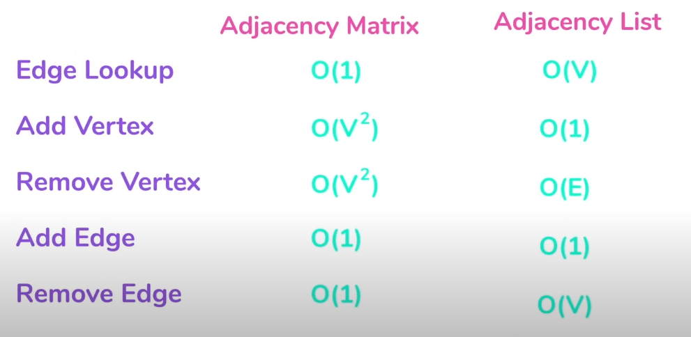

# My notes on DS and Algo

# Table of Contents

1. [Graphs](#Graphs)
   1. [Graph Data Structure](#gds)
   1. [Tree/Graph Traversal Algorithms](#traversal)
      1. [Binary Tree Traversal](#btt)
      1. [Depth First Search](#dfs)
      1. [BFS](#bfs)

## Graphs

- Representing Graphs : 

  - [Adjacency List](./Datastructure%20and%20Algo%20in%20Golang/adjacency_list.go)

    - Every Vertex stores a list of adjacent vertices.
    - Each index of a list could be used to represent the vertex and the elements represent adjacent vertices.

      

  - [Adjacency Matrix](./Datastructure%20and%20Algo%20in%20Golang/adjacency_matrix.go)

    - Representing graphs as 2 dimensional matrix.
      - Edge is represented by the value of i,j in matrix.
      - To add a vertex, add a row and column
    - If the graph is weighted, the value of each matrix would be the weights instead of 1s and 0s.
    - If the graph is undirected, it means that there is symmetry about the diagonal of the matrix, because the edges are bi-directional.

    - Comparing Adjacency Matrix and List

      - Matrix requries more space. n^2
      - Adjancy matrix is faster for Edge lookup O(1) vs O(V)
        Time Complexity

        

### Tree/Graph Traversal Algorithms 

- Breadth-first search is guaranteed to find a shortest possible path between two vertices in a graph. Depth-first search is not (and usually does not).
- DFS is preferred if we want to visit every node in the graph.
- DFS : Stack ; BFS : Queue
  

#### [Binary Tree Traversal](./Datastructure%20and%20Algo%20in%20Golang/tree_traversal.go) 

**In order**

      1. Visit Left Node
      1. Current Node
      1. Right Node

**Pre Order**

      1. Visit Current Node
      1. Visit Left Node
      1. Visit Right Node

**Post Order**

      1. Visit Left
      1. Right
      1. Current

#### [Depth-First Traversal](./Datastructure%20and%20Algo%20in%20Golang/graph_search.go) 

- DFS is a recursive algorithm that visits every node in a graph, starting from the source node and proceeding along the edges of the graph.
- DFS implements the order traversal just that it has 'visited' mark, so that it does not repeat the visiting.

#### [Breadth-First Traversal](<(./Datastructure%20and%20Algo%20in%20Golang/graph_search.go)>) 

- Breath First Search is a traversal algorithm that visits every the node's neighbors in a graph before visiting any of its neighbor's neighbours.
- BFS is a iterative algorithm that uses a queue to store the nodes that need to be visited.
- [Ref video](https://www.youtube.com/watch?v=QRq6p9s8NVg&ab_channel=GoGATEIIT)
