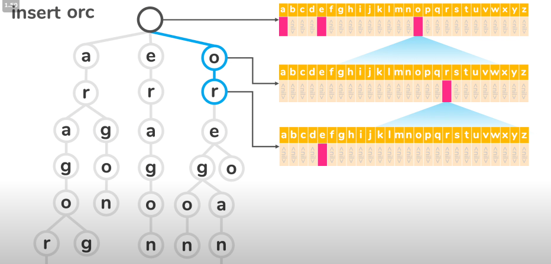
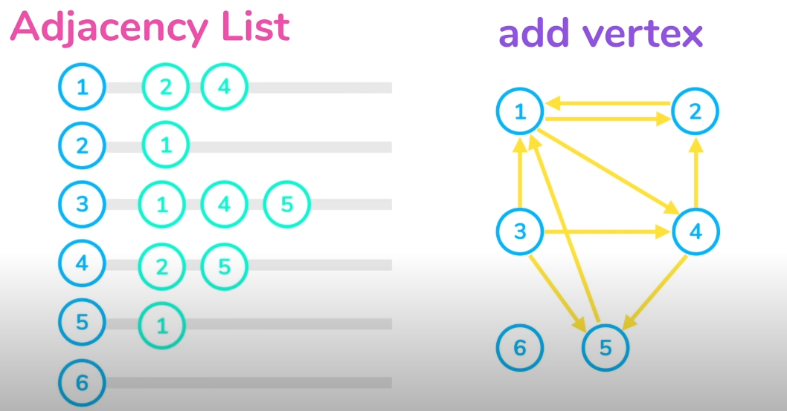
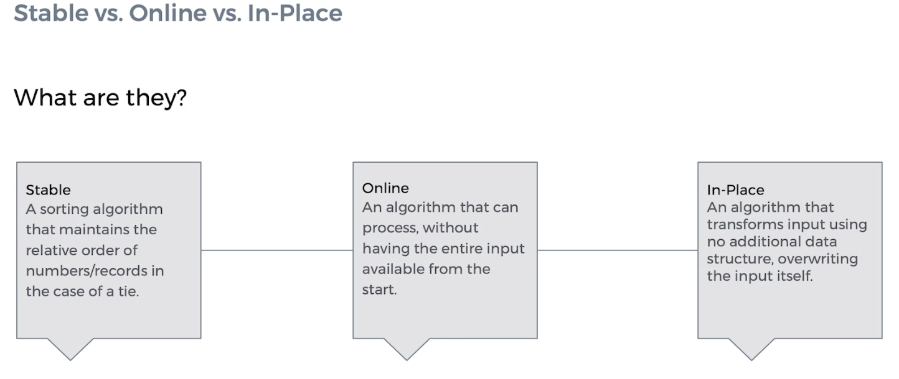

# My notes on DS and Algo

# Table of Contents

1. [Arrays](#arrays)
1. [LinkedList](#LinkedList)

1. [Trees](#Trees)

   1. [Types of trees:](#tts)
   1. [Tree/Graph Traversal Algorithms](#traversal)
   1. [Heap](#heap)
   1. [Priorty Queue](#priority-queue)
   1. [Trie](#trie)

1. [Graphs](#Graphs)
   1. [Graph Data Structure](#gds)
   1. [Tree/Graph Traversal Algorithms](#traversal)
      1. [Binary Tree Traversal](#btt)
      1. [Depth First Search](#dfs)
      1. [BFS](#bfs)
      1. [Topological Sort](#topological-sort)
1. [Algorithms](#Algorithms)
   1. [Others](#others)
   1. [Sorting](#sorting)
   1. [Searching](#searching)
      1. [Binary Search](./DS%20%26%20Algo%20in%20python/binarysearch.md)

## Arrays

Advantages of array

- Reading and writing is O(1)

Disadvantages of array

- Insertion and deletion is O(n)
- Arrays are not dynamic
  - If you need to store an extra element, you would have to create a new array and copy all the elements over. O(n)

List Slicing in python

- [start:stop:step]
- Reverse a list `list[::-1]`

## LinkedList

- Linked lists are great for problems that require arbitrary insertion.
- Dynamic arrays allow inserting at arbitrary locations, but they require you to move all elements after your insertion point.
- Doubly LinkedLists don’t have this problem: you can insert or delete elements in a linked list in constant time, as long as you know where the element is.
- The downside is that they don’t allow constant time access: to find the ith element, you need to traverse i elements, whereas arrays can do this in constant time. .
- Use them where insertion speed is important, but not when you want to access elements based on their index.


## Trees

**Types of trees:** <a name="tts"></a>

- Binary Search Tree (most interview questions are asking about binary search trees)
  - for each node, its left child is less than the node, which is less than its right child.
- Balanced
  - Balanced means the difference between the heights of the left and right subtrees is no more than 1.
  - This ensures O(log n) time for both search and insert.
- Complete
  - A complete binary tree is a binary tree in which every level, except possibly the last, is completely filled, and all nodes are as far left as possible.
- Full
  - A full binary tree is a binary tree in which every node has either 0 or 2 children.
- Perfect
  - Full & Complete
- Binary Heaps (Min/Max)
  - Complete Binary Search Tree where each node is smaller than its childs.
  - the root is the minimum
- Tries(Prefix Trees)

### Binary Search Tree

Binary search trees are useful, because they allow you to find elements in O(log n) time, but unlike a sorted array, you can do insertions at an average of O(log n) time, as opposed to O(n) potentially.


### Heap


- for max heap or min heap, the parent is always greater/less than or equal to the children.

#### Implementation

Array implementation
For an array implementation in heaps, the index starts from 1, not 0. The first index represents a value “root”, which is why it is kept empty.

#### Functions

- Heapify
  - Heapify is a function that turns an unordered array into a heap.
- HeapSort

### Priority Queue

Priority queue is an abstract data type (an interface definition) that defines three operations: `is_empty, insert_with_priority, and pull_highest_priority_element`. The definition says what those functions are expected to do, but it doesn't say how it is to be implemented.

A binary heap is one way to implement a priority queue. Its advantages are ease of implementation and that it is reasonably efficient.

### [Trie](./Datastructure%20and%20Algo%20in%20Golang/trie.go)

- A trie is a kind of tree data structure that is used to store a dynamic set of strings.
- A trie is a tree where each node represents a prefix (or partial key).
- Booleans are used to indicate if a prefix is a complete key or not.

**Advantages of using Trie:**

- It can tell us if a string is a prefix of any valid words and a tree can do it in O(K) time where K is the length of the string.
- Many problems involving list of words can be solved using a trie. In situations when we search through the tree on related prefixes repeatedly (e.g looking up M, then MA,MAN,MANY) we might pass a reference to the current node in the tree

  

Key Functions:

- `insert`: Inserts a new key into the trie.

```
1. For each character in the word, create a new node as a child of the current node if it does not already exist.
2. Mark the current node as complete if it is a prefix of the word.
```

- `search`: Searches for a key in the trie.

Time Complexity:

- `insert`: O(lg n)
- `search`: O(m) where m is the length of the key.
- Tradoff?

Use case:

- many problems involving lists of words leverage trie as optimisation
- Storing a dictionary of words for quick lockup
- autocomplete

## Graphs

- Representing Graphs : <a name="gds"></a>

  - [Adjacency List](./Datastructure%20and%20Algo%20in%20Golang/adjacency_list.go)

    - Every Vertex stores a list of adjacent vertices.
    - Each index of a list could be used to represent the vertex and the elements represent adjacent vertices.

      

  - [Adjacency Matrix](./Datastructure%20and%20Algo%20in%20Golang/adjacency_matrix.go)

    - Representing graphs as 2 dimensional matrix.
      - Edge is represented by the value of i,j in matrix.
      - To add a vertex, add a row and column
    - If the graph is weighted, the value of each matrix would be the weights instead of 1s and 0s.
    - If the graph is undirected, it means that there is symmetry about the diagonal of the matrix, because the edges are bi-directional.

    - Comparing Adjacency Matrix and List

      - Matrix requries more space. n^2
      - Adjancy matrix is faster for Edge lookup O(1) vs O(V)
        Time Complexity

        

### Tree/Graph Traversal Algorithms <a name="traversal"></a>

- Breadth-first search is guaranteed to find a shortest possible path between two vertices in a graph. Depth-first search is not (and usually does not).
- DFS is preferred if we want to visit every node in the graph.
- DFS : Stack ; BFS : Queue

  

#### [Binary Tree Traversal](./Datastructure%20and%20Algo%20in%20Golang/tree_traversal.go) <a name="btt"></a>

**In order**

      1. Visit Left Node
      1. Current Node
      1. Right Node

**Pre Order**

      1. Visit Current Node
      1. Visit Left Node
      1. Visit Right Node

**Post Order**

      1. Visit Left
      1. Right
      1. Current

#### [Depth-First Traversal](./Datastructure%20and%20Algo%20in%20Golang/graph_search.go) <a name="dfs"></a>

- DFS is a recursive algorithm that visits every node in a graph, starting from the source node and proceeding along the edges of the graph.
- DFS implements the order traversal just that it has 'visited' mark, so that it does not repeat the visiting.

#### [Breadth-First Traversal](<(./Datastructure%20and%20Algo%20in%20Golang/graph_search.go)>) <a name="bfs"></a>

- BFS is a iterative algorithm that uses a queue to store the nodes that need to be visited.

**Algorithm:**

```
1. Enqueue the source node
2. while the queue is not empty, dequeue a node
3. Visit the node if not visited
4. Enqueue the children of the node
```

[Ref video](https://www.youtube.com/watch?v=QRq6p9s8NVg&ab_channel=GoGATEIIT)

#### DFS VS BFS


### Topological Sort

Topological Sort is a linear ordering of vertices such that for every directed edge uv from vertex u to vertex v, u comes before v in the ordering.


Degree of a vertex is the number of edges connected to it.

| In degree :                                                                                         | Out degree :                                             |
| --------------------------------------------------------------------------------------------------- | -------------------------------------------------------- |
| In degree is the number of edges coming into a vertex. In degree is 0 if the vertex is a leaf node. | Out degree is the number of edges going out of a vertex. |

Applications

- Task Scheduling
- Build Systems
- Course Scheduling

Algorithm:

```
1. Create a set of all vertices with no incoming edges
2. While there are vertices in the set
    1. Pick a vertex u
    2. Remove u from the set
    3. For each vertex v such that there is an edge from u to v
        1. Remove edge uv from graph
        2. Add v to the set
```

# Algorithms

## Sorting

### Bubble Sort

The idea is to compare two elements and swap them if they are in wrong order.
Optimise by

1. Checking if there are any more swaps to be made. If not, stop.
2. Every time a swap is made, change the index of the array to the latest index of sorted array.

```python
def bubble_sort(arr):
    n = len(arr)
    for i in range(1, n):
        for j in range(1, n):
            first_number = arr[j-1]
            second_number = arr[j]
            if first_number > second_number:
                arr[j] = first_number
                arr[j-1] = second_number
    return arr


def optimized_bubble_sort(arr):
    n = len(arr)
    list_sorted = False
    while list_sorted is False:
        list_sorted = True
        for i in range(1, n):
            first_number = arr[i-1]
            second_number = arr[i]
            if first_number > second_number:
                arr[i], arr[i-1] = swap(arr[i-1], arr[i])
                list_sorted = False
    return arr


def v4_bubble_sort(arr):
    n = len(arr)
    list_sorted = False
    while not list_sorted:
        list_sorted = True
        new_n = 0
        for i in range(1, n):
            first_number = arr[i-1]
            second_number = arr[i]
            if first_number > second_number:
                arr[i], arr[i-1] = swap(arr[i-1], arr[i])
                list_sorted = False
                new_n = i  # updating latest sorted index
        n = new_n  # stop sorting as the next n elements are already sorted
    return arr
```

### Selection Sort

The idea is to find the minimum element and swap it with the first element.

### Insertion Sort

The idea is to iterate through the array. For each element, find the position where it belongs (more than left for ascending) and insert it there.

Optimization:

- To optimize the algorithm, instead of swapping the elements, we can just move the elements to the right and keep track of the current index.

## Others


Stable : Maintains the relative order of elements with the same key.
Online : Algorithm can operate without seeing the entire list of elements. O(1)
In place : Uses additional space to store the result.

```

```
